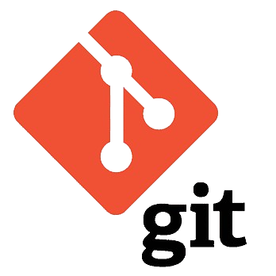

# Git

Git est un système de contrôle de version qui trace les changements dans le code source.

- Il utilise des dépôts pour stocker des instantanés complets du projet à chaque commit.

- Les branches permettent de travailler sur des versions distinctes du code. Les commits enregistrent les modifications avec des messages descriptifs.

- Git conserve un historique complet des changements pour suivre l'évolution du projet.

## Sommaire

<ul>
    <li><a href="./git/02-install/install.md">Installation</a></li>
    <li><a href="./git/03-scenario/article.md">Utiliser Git</a></li>
    <li><a href="./git/01-about-git/about-git.md">À propos de Git</a></li>
    <li><a href="./git-flow/README.md">Git-Flow</a></li>
    <li><a href="./convention-commit/convention.md">Convention de commit</a></li>
</ul>

## Cheat sheet

<table>
    <thead>
        <tr>
            <th>Commande</th>
            <th>Fonction</th>
            <th>Exemple</th>
        </tr>   
    </thead>
    <tbody>
        <tr>
            <th colspan="3" align="left">Setup & Init</th>
        </tr>
        <tr>
            <td align="right"><code>git init</code></td>
            <td>Initialise le dossier courant en depot Git local</td>
            <td></td>
        </tr>
         <tr>
            <td align="right"><code>git clone [url]</code></td>
            <td>Récupère l'entièreté d'un dépot distant via URL</td>
            <td><code>git clone git@github.com:Simplon-hdf/cheats-sheets-git-flow.git</code></td>
        </tr>
        <tr>
            <th colspan="3" align="left">Staging</th>
        </tr>
            <td align="right"><code>git status</code></td>
            <td>Affiche les fichiers modifiés dans le working directory</td>
            <td></td>
        </tr>
        <tr>
            <td align="right"><code>git add [fichier]</code></td>
            <td>Ajoute un fichier au prochain commit (en staging)</td>
            <td><code>git add exemple.md</code></td>
        </tr>
        <tr>
            <td align="right"><code>git reset [fichier]</code></td>
            <td>Enlève un fichier du staging tout en gardant les changement dans le working directory</td>
            <td><code>git reset exemple.md</code></td>
        </tr>
         <tr>
            <td align="right"><code>git diff</code></td>
            <td>Différence des changements pas en staging</td>
            <td></td>
        </tr>
        <tr>
            <td align="right"><code>git diff --staged</code></td>
            <td>Différence du staging mais pas encore commit</td>
            <td></td>
        </tr>
        <tr>
            <td align="right"><code>git diff [branche locale] [branche distante]</code></td>
            <td>Compare les différences entre une branche locale et distante</td>
            <td><code>git diff develop main</code></td>
        </tr>
        <tr>
            <td align="right"><code>git commit -m [message]</code></td>
            <td>Effectue le commit contenant les fichiers en staging</td>
            <td><code>git commit -m "Renamed exemple.md"</code></td>
        </tr>
        <tr>
            <th colspan="3" align="left">Branches</th>
        </tr>
        <tr>
            <td align="right"><code>git branch -av</code></td>
            <td>Liste les branches. Un * apparaitra à coté de la branche actuelle</td>
            <td></td>
        </tr>
        <tr>
            <td align="right"><code>git branch [branche]</code></td>
            <td>Créer une nouvelle branche</td>
            <td><code>git branch main</code></td>
        </tr>
        <tr>
            <td align="right"><code>git switch [branche]</code></td>
            <td>Change la branche courante</td>
            <td><code>git switch develop</code></td>
        </tr>
        <tr>
            <td align="right"><code>git branch -d [branche]</code></td>
            <td>Supprime la branche locale</td>
            <td><code>git branch -d develop</code></td>
        </tr>
        <tr>
            <td align="right"><code>git checkout --track</code></td>
            <td>Créer une nouvelle branche trackée à partir d'une branche distante</td>
            <td></td>
        <tr>
            <td align="right"><code>git tag [tag-name]</code></td>
            <td>Créer un tag sur le commit actuel</td>
            <td><code>git tag v1.0</code></td>
        </tr>
        </tr>
        <tr>
            <th colspan="3" align="left">Historique</th> 
        </tr>
        <tr>
            <td align="right"><code>git log</code></td>
            <td>Affiche l'historique commits</td>
            <td></td>
        </tr>
        <tr>
            <td align="right"><code>git log -p [fichier]</code></td>
            <td>Affiche l'historique des commits sur un fichier spécifique</td>
            <td><code>git log -p exemple.md</code></td>
        </tr>
        <tr>
            <td align="right"><code>git blame [fichier]</code></td>
            <td>Affiche l'historique des modifications, y compris l'auteur sur un fichier spécifique</td>
            <td><code>git blame exemple.md</code></td>
        </tr>
        <tr>
            <th colspan="3" align="left">Mise à jour et publication</th>
        </tr>
        <tr>
            <td align="right"><code>git remote -v</code></td>
            <td>Liste les remote configurés</td>
            <td></td>
        </tr>
        <tr>
            <td align="right"><code>git remote show [remote]</code></td>
            <td>Affiche les informations de la remote</td>
            <td><code>git remote show origin</code></td>
        </tr>
        <tr>
            <td align="right"><code>git remote add [remote] [url]</code></td>
            <td>Ajoute une nouvelle remote au nom donné</td>
            <td><code>git remote add origin git@github.com:Simplon-hdf/cheats-sheets-git-flow.git</code></td>
        </tr>
        <tr>
            <td align="right"><code>git fetch [remote]</code></td>
            <td>Récupère toutes les modifications de la remote sans merge les changements</td>
            <td><code>git fetch origin</code></td>
        </tr>
        <tr>
            <td align="right"><code>git pull [remote] [branche]</code></td>
            <td>Récupère les modifications de la branche, et les merge</td>
            <td><code>git pull origin main</code></td>
        </tr>
        <tr>
            <td align="right"><code>git push [remote] [branche]</code></td>
            <td>Poussant ses modifications sur la branche au repo distant</td>
            <td><code>git push origin main</code></td>
        </tr>
        <tr>
            <th colspan="3" align="left">Merge & Rebase</th>
        </tr>
        <tr>
            <td align="right"><code>git merge [branche]</code></td>
            <td>Merge la branche dans la branche actuelle</td>
            <td><code>git merge main</code></td>
        </tr>
        <tr>
            <td align="right"><code>git rebase [branche]</code></td>
            <td>Réécrit l'historique des commit de la branche actuelle vers la branche spécifiée</td>
            <td><code>git rebase main</code></td>
        </tr>
        <tr>
            <td align="right"><code>git rebase --abort</code></td>
            <td>Annule le processus de rebase en cours</td>
            <td></td>
        </tr>
        <tr>
            <td align="right"><code>git rebase --continue</code></td>
            <td>Poursuit le processus de rebase après la résolution des conflits</td>
            <td></td>
        </tr>
        <tr>
            <td align="right"><code>git mergetool</code></td>
            <td>Ouvre un outil de merge pour résoudre les conflits</td>
            <td></td>
        </tr>
        <tr>
            <th colspan="3" align="left"    >Rétablir/Annuler</th>
        </tr>
        <tr>
            <td align="right"><code>git reset --hard</code></td>
            <td>Réinitialise le staging et le working directory à HEAD</td>
            <td></td>
        </tr>
        <tr>
            <td align="right"><code>git checkout HEAD [fichier]</code></td>
            <td>Restaure un fichier a son état HEAD</td>
            <td><code>git checkout HEAD exemple.md</code></td>
        </tr>
        <tr>
            <td align="right"><code>git revert [commit]</code></td>
            <td>Annule les modifications d'un commit spécifique</td>
            <td><code>git revert 8d6fe82</code></td>
        </tr>
        <tr>
            <td align="right"><code>git reset --hard [commit]</code></td>
            <td>Réinitialise le staging et le working directory au commit spécifié</td>
            <td><code>git reset --hard 8d6fe82</code></td>
        </tr>
        <tr>
            <td align="right"><code>git reset [commit]</code></td>
            <td>Déplace la branche actuelle vers le commit spécifié</td>
            <td><code>git reset 8d6fe82</code></td>
        </tr>
        <tr>
            <td align="right"><code>git reset --keep [commit]</code></td>
            <td>Déplace la branche tout en conservant les modifications pas en staging</td>
            <td><code>git reset --keep 8d6fe82</code></td>
        </tr>
    </tbody>

</table>
